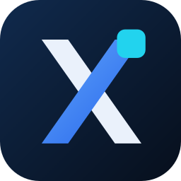
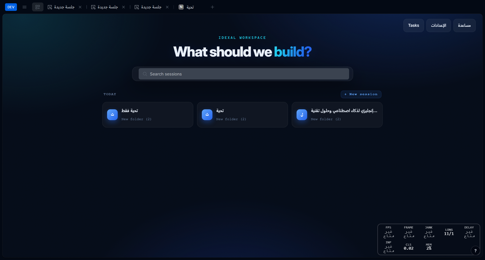
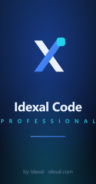

# Idexal Code

**A professional desktop coding-agent experience — by Idexal.**

Multi-model · automatic fallback · multi-agent tasks · inline autocomplete · a refined dark UI.

[**⬇ Download**](https://github.com/idexal/idexal-code/releases/latest) · [idexal.com](https://idexal.com) · [Support](mailto:maintainers@idexal.com)

---

## What is Idexal Code?

Idexal Code is a desktop application for building software with AI coding agents. It pairs a fast, focused chat workspace with serious agent infrastructure — multiple models, automatic failover, and the ability to run several agents in parallel — wrapped in a clean, dark "Aurora" interface.

It runs on **Windows** and **macOS**, and talks to a bundled local agent server, so your sessions stay on your machine.

## Features

- 🧠 **Multi-model + automatic fallback** — choose from every connected provider, and configure a fallback model that engages automatically when a model fails or runs out of credits — no interruption.
- 👥 **Multi-agent tasks** — launch one goal across several agents at once. Each runs in its own session, in parallel, tracked from a single panel.
- 🎯 **Per-agent models** — assign any available model (and its own fallback) to any agent.
- ⌨️ **Inline autocomplete** — Copilot-style ghost text drawn from your prompt history. Press `Tab` to accept, `Esc` to dismiss.
- 🎨 **Aurora design** — a cohesive Idexal dark theme: glass surfaces, an animated composer border, gradient accents, and a living backdrop.
- 📦 **Professional installer** — a branded setup wizard (welcome → license → install location → finish).

## Download & install

Grab the latest build from the [**Releases**](https://github.com/idexal/idexal-code/releases/latest) page:

| Platform | File |
|---|---|
| **Windows** (64-bit) | `Idexal-Code-Setup-<version>-x64.exe` |
| **Windows** (32-bit) | `Idexal-Code-Setup-<version>-ia32.exe` |
| **macOS** (Apple Silicon) | `Idexal-Code-<version>-arm64.dmg` |
| **macOS** (Intel) | `Idexal-Code-<version>-x64.dmg` |

**Windows:** run the installer and follow the wizard. **macOS:** open the `.dmg` and drag Idexal Code to Applications (on first launch, right-click → Open). The app **updates itself automatically** when a new release is published here.

## Tech

Electron + Vite + SolidJS on the front end, with a bundled local agent server as a sidecar. Idexal Code builds on the open-source **OpenCode** engine (MIT) and extends it with the features above and the Idexal experience.

## About

| | |
|---|---|
| **Company** | Idexal — [idexal.com](https://idexal.com) |
| **Founder** | Zakariae Lahbabi — [zakariaelahbabi.com](https://zakariaelahbabi.com) |
| **Support** | [maintainers@idexal.com](mailto:maintainers@idexal.com) |

## License

[MIT](LICENSE) © 2026 Idexal — Zakariae Lahbabi. Built on OpenCode (MIT).
